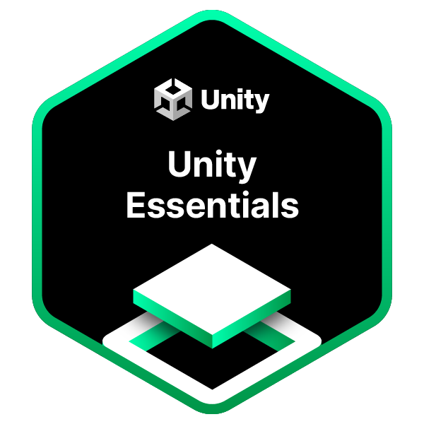

<h1 align="center">Hi 👋, I'm Marvin Argollo</h1>
<h3 align="center">A passionate game developer and electrical engineer/computer engineer in training</h3>

 burnt components: 4

  

<!--
  
-->

- 🔭 I’m currently working on **Zarollo**

- 🌱 I’m currently learning **Pentesting**

- 👯 I’m looking to collaborate on **unity and godot**

- 🤝 I'm looking for help with **game development**

- 👨‍💻 All of my projects are available to play at [https://argotech.itch.io](https://argotech.itch.io)

- 💬 Ask me about **anything**

- 📫 How to reach me **argollomarvin@gmail.com / argollo on Discord**

<h3 align="left">Connect with me:</h3>

<h3 align="left">Languages and Tools:</h3>

 
   
   
   
   
   
   
   
   
   
   
   
  

<h3 align="left">certificates:</h3>

  
  

<h2 align="left">cybersecurity:</h2>

